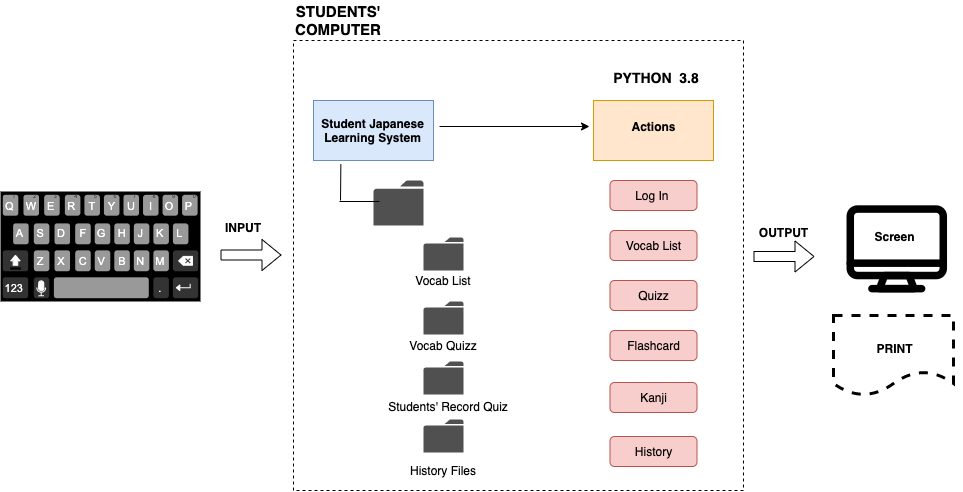

  **Fig1.** The initial design of the Food Management App. These picutes show the detail of the background of each function. These were made based on the success criteria
  
  
  
  **Fig2.** This is the system diagram of the Food Management Application showing the input, software and output.
  

  
  **Fig3.** The login ui design window containing username and password input only due to the user want to access only by himself. 
  

  
  **Fig4.** The list of functions window shows all the functions that the user can access through the program. Also, with the log out button, the user can log out and quit the program immediately.
  
 
  
  **Fig5.** The add new information of food ui windown allow the user add needed information for the new food. After saving, the information will be saved in the list of food table.
 
 
 
  
  **Fig6.** The list of food table will show all the food that the user have and also the properties of the food 
  
  
  
  
  **Fig7.** The summary windows will summarize the properties that the user input 
  
  
  
  
  **Fig8.** The delete function will delete the food inputted and all of its properties in the list of food
  
  
   
  
  **Fig9.** The edit window will allow the user to edit the information of the food in the table of food
  
  
  
  
  **Fig10.** The search window will allow the user to find the information of the food in the database file. The information of the food will be shown in the table.
  
  
  
  
  **Fig11.** This is the flowchart showing how the add window works
  
  
  
  
  **Fig12.** This is the flow chart showing how the delete window works
  
  
  ### Expected input and output
  
  #|Function|INPUT|OUTPUT
---|---|---|---
1| ADD FOOD | Name, Location, Quantity, Expiration, Price of Food|Data in the Databse file and in the food data table
2| EDIT FOOD | Name and properties of food need to be editted | New data in the Database file and in the food data table
3| SUMMARY | Properties needed to summarize | The total amount of the inputted properties
4| SEARCH FOOD | The name of the food | All the properties of the food will be shown in a table
5| DELETE FOOD | The name of the food | All the properties of the food included name of the food will be deleted from the database file and also the food data table

  ### Testing plan
  
  Due to the output data can be shown after using the functions right in the app, so that we can test the program by using using the program and look at the place where the output will be. This can be done right after finishing the code and by the user in the progress of using the program.

  
  
  
  
  
  
  

 
