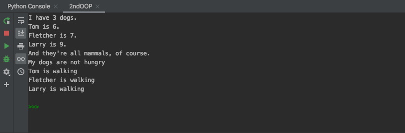

```.py
class Pets:
    dogs = []

    def __init__(self, dogs):
        self.dogs = dogs
        self.is_walks = False

    def walk(self):
        for inu in self.dogs:
            print(inu.walk())


class Dog:
    # Class attribute
    species = 'mammal'

    # Initializer / Instance attributes
    def __init__(self, name, age):
        self.name = name
        self.age = age
        self.is_hungry = True

    # Instance method
    def description(self):
        return self.name, self.age

    # Instance method
    def speak(self, sound):
        return "%s says %s" % (self.name, sound)

    # Instance method
    def eat(self):
        self.is_hungry = False

    def walk(self):
        return "{} is walking".format(self.name)


class RussellTerrier(Dog):
    def run(self, speed):
        return "%s runs %s" % (self.name, speed)


# Child class (inherits from Dog class)
class Bulldog(Dog):
    def run(self, speed):
        return "%s runs %s" % (self.name, speed)


# Create instance of dogs
dogs_name = [
    Bulldog("Tom", 6),
    RussellTerrier("Fletcher", 7),
    Dog("Larry", 9)
]

my_pets = Pets(dogs_name)

# Print output

print("I have {} dogs.".format(len(my_pets.dogs)))
for dog in my_pets.dogs:
    dog.eat()
    print("{} is {}.".format(dog.name, dog.age))

print("And they're all {}s, of course.".format(dog.species))

are_hungry = False
for dog in my_pets.dogs:
    if dog.is_hungry:
        are_hungry = True
if are_hungry:
    print('My dogs are hungry')
else:
    print('My dogs are not hungry')

my_pets.walk()
```


